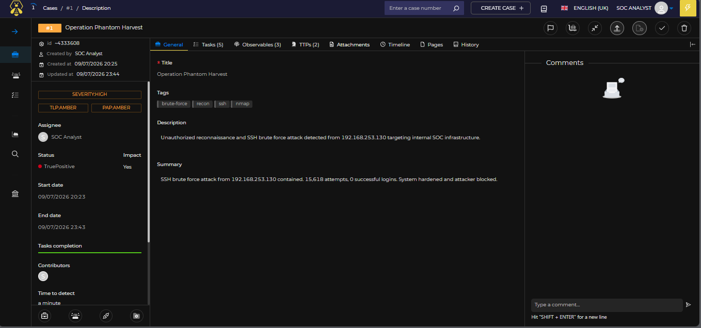
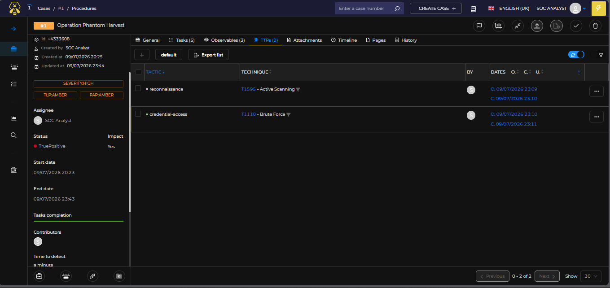
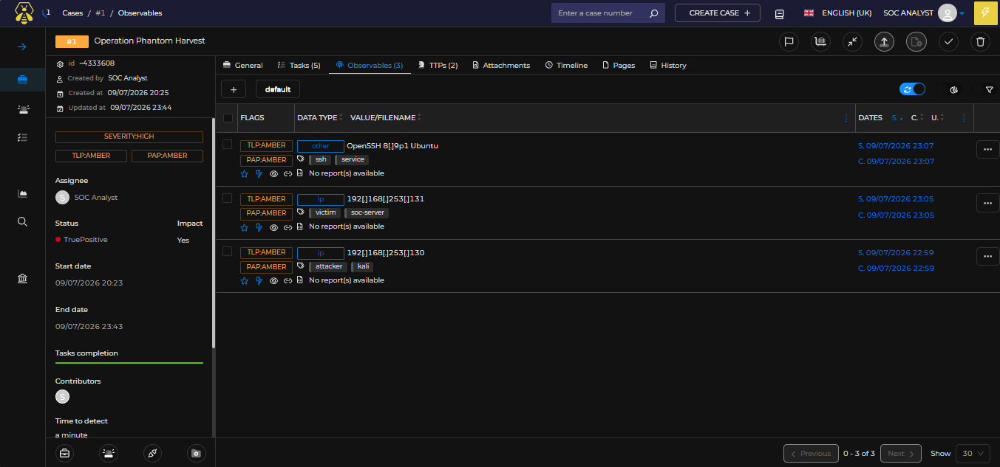
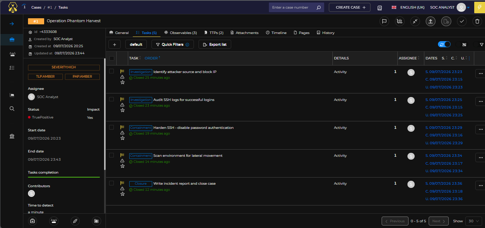
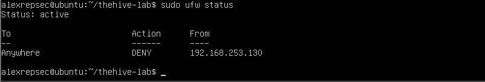
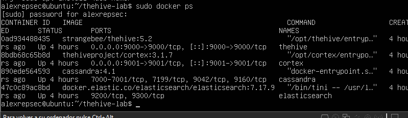

# 🐝 Case Management with TheHive — Operation Phantom Harvest
 


 
---
 
## 📋 Overview
 
This project demonstrates a **full incident response cycle** using TheHive 5 as a Case Management platform in a home SOC lab environment. A simulated attacker (Kali Linux) performs reconnaissance and credential attacks against the SOC server (Ubuntu 22.04), while the analyst manages the complete case lifecycle: detection, triage, containment, remediation, and closure — all documented within TheHive.
 
---
 
## 🧪 Scenario — Operation Phantom Harvest
 
> An unauthorized host is detected performing active reconnaissance and SSH brute force against internal SOC infrastructure. The analyst must manage the full incident response lifecycle using TheHive as the case management platform, from initial detection through containment and closure.
 
| Field | Value |
|---|---|
| Case Title | Operation Phantom Harvest |
| Case ID | #1 |
| Severity | HIGH |
| TLP | AMBER |
| PAP | AMBER |
| Status | True Positive |
| Impact | Yes |
| Start Date | 2026-07-09 20:23 |
| End Date | 2026-07-09 23:43 |
| Analyst | SOC Analyst |
 
---
 
## 🏗️ Lab Architecture
 
```
┌─────────────────────────────────────────────────────────────────┐
│                     VMware Workstation                          │
│                    NAT Network: 192.168.253.0/24                │
│                                                                 │
│   ┌─────────────────────────┐   ┌──────────────────────────┐   │
│   │   Ubuntu 22.04 (SOC)    │   │      Kali Linux          │   │
│   │   192.168.253.131       │   │   192.168.253.130        │   │
│   │                         │   │                          │   │
│   │  ┌───────────────────┐  │   │  ┌────────────────────┐ │   │
│   │  │   TheHive 5.2     │  │   │  │  nmap 7.95         │ │   │
│   │  │   :9000           │  │   │  │  hydra             │ │   │
│   │  ├───────────────────┤  │   │  │  rockyou.txt       │ │   │
│   │  │   Cortex 3.1.7    │  │   │  └────────────────────┘ │   │
│   │  │   :9001           │◄─┼───┼──── SSH Brute Force ────│   │
│   │  ├───────────────────┤  │   │  ──── Nmap Scan ────────│   │
│   │  │   Cassandra 4.1   │  │   └──────────────────────────┘  │
│   │  ├───────────────────┤  │                                  │
│   │  │  Elasticsearch    │  │                                  │
│   │  │   7.17.9          │  │                                  │
│   │  └───────────────────┘  │                                  │
│   │    Docker Compose        │                                  │
│   └─────────────────────────┘                                  │
└─────────────────────────────────────────────────────────────────┘
```
 
---
 
## 🛠️ Stack
 
| Component | Version | Role |
|---|---|---|
| TheHive | 5.2 | Case Management Platform |
| Cortex | 3.1.7 | Analyzer & Responder Engine |
| Cassandra | 4.1 | TheHive Database Backend |
| Elasticsearch | 7.17.9 | Index & Search Engine |
| Docker Compose | v5.3.1 | Container Orchestration |
| Ubuntu | 22.04 LTS | SOC Server |
| Kali Linux | 2024.x | Attacker Machine |
| nmap | 7.95 | Reconnaissance Tool |
| Hydra | — | Brute Force Tool |
 
---
 
## 📁 Repository Structure
 
```
thehive-case-management/
├── docker-compose.yml          # Full stack deployment
├── thehive/
│   ├── data/                   # TheHive persistent data
│   └── logs/                   # TheHive logs
├── cortex/
│   └── neurons/                # Cortex analyzer modules
├── cassandra/
│   └── data/                   # Cassandra persistent data
├── elasticsearch/
│   └── data/                   # Elasticsearch persistent data
├── screenshots/
│   ├── overall-case-view.png
│   ├── tasks-view.png
│   ├── observables-view.png
│   ├── ttp-tab.png
│   ├── docker-ps.png
│   └── firewall-status.png
└── README.md
```
 
---
 
## 🚀 Deployment
 
### Prerequisites
 
- VMware Workstation / Fusion
- Ubuntu 22.04 LTS (minimum 4GB RAM, 2 CPUs, 18GB disk)
- Kali Linux (2GB RAM)
- Both VMs on VMware NAT network
### 1. Install Docker
 
```bash
# Remove old versions
sudo apt remove -y docker docker-engine docker.io containerd runc 2>/dev/null
 
# Update and install dependencies
sudo apt update && sudo apt upgrade -y
sudo apt install -y ca-certificates curl gnupg lsb-release
 
# Add Docker GPG key
sudo install -m 0755 -d /etc/apt/keyrings
curl -fsSL https://download.docker.com/linux/ubuntu/gpg | sudo gpg --dearmor -o /etc/apt/keyrings/docker.gpg
sudo chmod a+r /etc/apt/keyrings/docker.gpg
 
# Add Docker repository
UBUNTU_CODENAME=$(lsb_release -cs)
echo "deb [arch=amd64 signed-by=/etc/apt/keyrings/docker.gpg] https://download.docker.com/linux/ubuntu $UBUNTU_CODENAME stable" | sudo tee /etc/apt/sources.list.d/docker.list
 
# Install Docker
sudo apt update
sudo apt install -y docker-ce docker-ce-cli containerd.io docker-buildx-plugin docker-compose-plugin
 
# Enable and verify
sudo systemctl enable docker --now
sudo usermod -aG docker $USER
newgrp docker
docker --version
docker compose version
```
 
### 2. Prepare Directory Structure
 
```bash
mkdir -p ~/thehive-lab/{thehive,cortex,cassandra,elasticsearch,nginx}
cd ~/thehive-lab
mkdir -p cassandra/data elasticsearch/data thehive/data thehive/logs cortex/neurons
 
# Fix permissions for Elasticsearch
sudo chown -R 1000:1000 ~/thehive-lab/elasticsearch/data
sudo chown -R 1000:1000 ~/thehive-lab/thehive/data
sudo chown -R 1000:1000 ~/thehive-lab/thehive/logs
```
 
### 3. Docker Compose Configuration
 
```yaml
version: "3.8"
 
services:
  cassandra:
    image: cassandra:4.1
    container_name: cassandra
    restart: unless-stopped
    environment:
      - CASSANDRA_CLUSTER_NAME=thehive
      - CASSANDRA_DC=dc1
      - CASSANDRA_ENDPOINT_SNITCH=GossipingPropertyFileSnitch
    volumes:
      - ./cassandra/data:/var/lib/cassandra
    networks:
      - thehive-net
 
  elasticsearch:
    image: docker.elastic.co/elasticsearch/elasticsearch:7.17.9
    container_name: elasticsearch
    restart: unless-stopped
    environment:
      - discovery.type=single-node
      - xpack.security.enabled=false
      - ES_JAVA_OPTS=-Xms512m -Xmx512m
    volumes:
      - ./elasticsearch/data:/usr/share/elasticsearch/data
    networks:
      - thehive-net
 
  cortex:
    image: thehiveproject/cortex:3.1.7
    container_name: cortex
    restart: unless-stopped
    environment:
      - job_directory=/tmp/cortex-jobs
    volumes:
      - ./cortex/neurons:/neurons
      - /var/run/docker.sock:/var/run/docker.sock
    ports:
      - "9001:9001"
    depends_on:
      - elasticsearch
    networks:
      - thehive-net
 
  thehive:
    image: strangebee/thehive:5.2
    container_name: thehive
    restart: unless-stopped
    environment:
      - JVM_OPTS=-Xms1024m -Xmx1024m
    volumes:
      - ./thehive/data:/opt/thp/thehive/data
      - ./thehive/logs:/opt/thp/thehive/logs
    ports:
      - "9000:9000"
    depends_on:
      - cassandra
      - elasticsearch
      - cortex
    networks:
      - thehive-net
 
networks:
  thehive-net:
    driver: bridge
```
 
### 4. Launch the Stack
 
```bash
cd ~/thehive-lab && docker compose up -d
 
# Verify all containers are running
docker ps
```
 
Expected output — all 4 containers `Up`:
 
```
CONTAINER ID   IMAGE                                       STATUS
0ad934480435   strangebee/thehive:5.2                     Up About an hour
8bdb68c65b8d   thehiveproject/cortex:3.1.7                Up About an hour
890ede564593   cassandra:4.1                              Up About an hour
47c0c89ac8bd   docker.elastic.co/elasticsearch/...7.17.9  Up About an hour
```
 
### 5. Access
 
| Service | URL | Default Credentials |
|---|---|---|
| TheHive | `http://<ubuntu-ip>:9000` | `admin@thehive.local` / `secret` |
| Cortex | `http://<ubuntu-ip>:9001` | `admin` / `secret` |
 
---
 
## ⚙️ Initial Configuration
 
### TheHive Setup
 
1. Login → Change admin password
2. **Admin → Organizations → Create organization**
   - Name: `SOC-Lab`
   - Description: `Operation Phantom Harvest Lab`
3. Create analyst user inside the organization
   - Login: `analyst@soc-lab.local`
   - Role: `analyst`
### Cortex Setup
 
1. Login → Create organization `SOC-Lab`
2. Create user with role `orgadmin`
3. Generate API Key → copy for TheHive integration
### Connect Cortex to TheHive
 
**Admin → Platform Management → Connectors → Cortex → Add server**
 
| Field | Value |
|---|---|
| Name | `Cortex-SOC` |
| URL | `http://cortex:9001` |
| API Key | `<your-cortex-api-key>` |
 
Click **Test connection** → should return `success`.
 
---
 
## ⚔️ Attack Simulation (Kali Linux)
 
All commands executed from `192.168.253.130` (Kali) targeting `192.168.253.131` (Ubuntu SOC).
 
### Phase 1 — Reconnaissance
 
```bash
# SYN scan with service version detection
nmap -sS -sV -p 22,80,443,8080,9000,9001 192.168.253.131
```
 
```
PORT     STATE  SERVICE     VERSION
22/tcp   open   ssh         OpenSSH 8.9p1 Ubuntu 3ubuntu0.15
9000/tcp open   cslistener?
9001/tcp open   tor-orport?
```
 
```bash
# Aggressive scan — OS detection, scripts, traceroute
nmap -A -T4 192.168.253.131
```
 
### Phase 2 — Credential Attack
 
```bash
# SSH brute force with rockyou.txt wordlist
hydra -l admin -P /usr/share/wordlists/rockyou.txt ssh://192.168.253.131 -t 4 -V -f
```
 
Result: **15,618 failed attempts — 0 successful logins.**
 
---
 
## 🗂️ Case Management in TheHive
 
### Case Details
 

 
### MITRE ATT&CK TTPs
 

 
| Tactic | Technique | Description |
|---|---|---|
| Reconnaissance | T1595 - Active Scanning | nmap SYN and aggressive scans |
| Credential Access | T1110 - Brute Force | SSH brute force via Hydra + rockyou.txt |
 
### Observables (IOCs)
 

 
| Type | Value | Tags | Role |
|---|---|---|---|
| IP | `192.168.253.130` | attacker, kali | Source of attack |
| IP | `192.168.253.131` | victim, soc-server | Target |
| Other | `OpenSSH 8.9p1 Ubuntu` | ssh, service | Targeted service |
 
### Tasks — Incident Response Workflow
 

 
| # | Group | Task | Status |
|---|---|---|---|
| 1 | Investigation | Identify attacker source and block IP | ✅ Closed |
| 2 | Investigation | Audit SSH logs for successful logins | ✅ Closed |
| 3 | Containment | Harden SSH - disable password authentication | ✅ Closed |
| 4 | Containment | Scan environment for lateral movement | ✅ Closed |
| 5 | Closure | Write incident report and close case | ✅ Closed |
 
---
 
## 🔒 Incident Response Actions
 
### Task 1 — Identify & Block Attacker
 
```bash
# Review SSH auth logs
sudo grep "192.168.253.130" /var/log/auth.log | tail -20
 
# Block attacker IP with UFW
sudo ufw enable
sudo ufw deny from 192.168.253.130 to any
sudo ufw status
```
 

 
### Task 2 — Audit SSH Logs
 
```bash
# Check for any successful logins
sudo grep "Accepted" /var/log/auth.log
 
# Count total brute force attempts
sudo grep "Failed password" /var/log/auth.log | grep "192.168.253.130" | wc -l
 
# Review active sessions
last | head -20
```
 
Result: **0 successful logins. 15,618 failed attempts.**
 
### Task 3 — SSH Hardening
 
```bash
# Backup original config
sudo cp /etc/ssh/sshd_config /etc/ssh/sshd_config.bak
 
# Disable password authentication
sudo sed -i 's/#PasswordAuthentication yes/PasswordAuthentication no/' /etc/ssh/sshd_config
sudo sed -i 's/PasswordAuthentication yes/PasswordAuthentication no/' /etc/ssh/sshd_config
 
# Reduce max auth tries
sudo sed -i 's/#MaxAuthTries 6/MaxAuthTries 3/' /etc/ssh/sshd_config
 
# Verify and restart
sudo grep -E "PasswordAuthentication|MaxAuthTries" /etc/ssh/sshd_config | grep -v "#"
sudo systemctl restart ssh
```
 
### Task 4 — Lateral Movement Scan
 
```bash
# Check active external connections
ss -tnp
 
# Verify listening services
sudo ss -tulnp
 
# Check logged in users
who && w
 
# Review running processes
ps aux --sort=-%cpu | head -20
 
# Audit crontabs
sudo crontab -l 2>/dev/null
sudo ls -la /etc/cron*
```
 
Result: **No suspicious connections. No backdoors. No lateral movement detected.**
 
---
 
## 📊 Incident Summary
 
```
┌─────────────────────────────────────────────────────────┐
│              INCIDENT REPORT SUMMARY                    │
│              Operation Phantom Harvest                  │
├─────────────────────────────────────────────────────────┤
│  Attack Vector    │ SSH Brute Force (Port 22)           │
│  Source IP        │ 192.168.253.130 (Kali)              │
│  Target IP        │ 192.168.253.131 (Ubuntu SOC)        │
│  Total Attempts   │ 15,618                              │
│  Successful Logins│ 0                                   │
│  Lateral Movement │ NOT DETECTED                        │
│  Data Exfiltrated │ NONE                                │
│  System Compromise│ NEGATIVE                            │
├─────────────────────────────────────────────────────────┤
│  VERDICT          │ True Positive — Contained           │
│  Impact           │ Yes (resource exhaustion on sshd)   │
└─────────────────────────────────────────────────────────┘
```
 
### Incident Timeline
 
| Time (UTC) | Event |
|---|---|
| 20:15 | nmap SYN scan initiated from 192.168.253.130 |
| 20:17 | Aggressive nmap scan — open services enumerated |
| 20:20 | SSH brute force started via Hydra + rockyou.txt |
| 23:15 | Case #1 created in TheHive — investigation started |
| 23:23 | Attacker IP blocked via UFW firewall |
| 23:25 | SSH audit — 15,618 failed attempts, 0 successful |
| 23:29 | SSH hardened — PasswordAuthentication disabled |
| 23:34 | Lateral movement scan — system clean |
| 23:43 | Case closed as True Positive |
 
---
 
## 🖥️ Infrastructure Verification
 
### Docker Stack Running
 

 
### UFW Firewall Active
 

 
---
 
## 🎯 Skills Demonstrated
 
- **Case Management** — Full incident lifecycle in TheHive 5
- **SIEM Integration** — TheHive + Cortex connector configuration
- **Container Orchestration** — Multi-service Docker Compose deployment
- **Threat Detection** — SSH brute force identification via auth logs
- **MITRE ATT&CK Mapping** — T1595, T1110
- **IOC Documentation** — Structured observable tracking
- **Incident Response** — Detection → Containment → Remediation → Closure
- **SSH Hardening** — Disabling password auth, reducing MaxAuthTries
- **Firewall Management** — UFW rule creation and verification
- **Linux Forensics** — Log analysis, process auditing, crontab review
---
 
## ⚠️ Disclaimer
 
This project was conducted in an isolated VMware NAT lab environment. All attack simulations were performed against virtual machines owned and controlled by the author for educational and portfolio purposes only. No real systems or networks were harmed.
 
---
 
## 👤 Author
 
**Alex** — [@alexrepsec](https://github.com/alexrepsec)
 
Cybersecurity enthusiast building hands-on SOC labs for learning and portfolio development.
